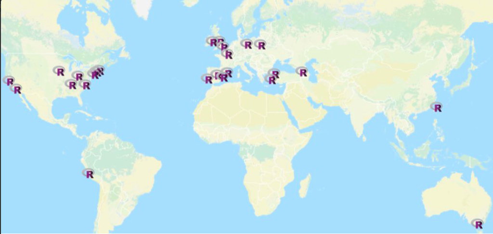
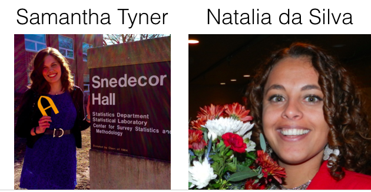

 <style>
 .title-slide {
     background-image: url(imgs/R-LadiesGlobal_banner.png);
     background-repeat: no-repeat;
        background-size: 400px 200px;
   }
   </style>

```{r setup, include=FALSE}
knitr::opts_chunk$set(echo = TRUE)
```


##<span style="color:#88398A">Oultine</span> 
1. R-Ladies Global
2. R-ladies Ames
3. Meeting ideas
4. Know about each other
5. Pick first meeting topic
6. Socializing

##<span style="color:#88398A">R-Ladies Global</span> 

"R-Ladies is a worldwide organization whose mission is to promote Gender Diversity in the R community""


We are underrepresented in every role:

* package developers
* conference speakers
* conference participants
* leadership positions
* ....

Encourage women to be represented in ......


##<span style="color:#88398A">R-Ladies Global</span> 

* R-Ladies was founded by Gabriela de Queiroz in San Francisco in October 2012!

* Today there are groups in 25 cities around the world
<center>


</center>

## <span style="color:#88398A">R-Ladies Organization Structure</span>


## <span style="color:#88398A">Want to know more?</span>

Web presence:

* Website: http://www.rladies.org
* E-mail: info@rladies.org
* Twitter: @RLadiesGlobal
* Slack: http://r-ladies.slack.com
* GitHub: http://github.com/rladies
* Global directory of female R practitioners / speakers: https://rladies.org/ladies/


##<span style="color:#88398A">R-Ladies Ames</span> 


* Ames chapter: November 2016 
* 40 members now!

Organizers:

 


* Twitter: @RLadiesAmes 
* E-mail: ames@rladies.org
* Meetup: http://meetup.com/R-Ladies-Ames/

##<span style="color:#88398A">R-ladies Ames: R-Ladies Ames</span> 

```{r, echo=FALSE,message=FALSE,warning=FALSE,cache=TRUE}
library(ggplot2)
library()
dat <- read.csv("info.csv", header=TRUE)
ggplot(data = dat, aes(x=ISU)) + geom_bar(aes(y=(..count..)/sum(..count..)))  + labs(y = "Proportion",  x = "ISU")

```


##<span style="color:#88398A">R-ladies Ames: Meeting frequency</span> 

```{r, echo=FALSE,fig.height=5,fig.width=5,message=FALSE,warning=FALSE,cache=TRUE}
ggplot(data = dat, aes(x=often)) + geom_bar(aes(y=(..count..)/sum(..count..))) + theme(axis.text.x =  element_text(angle=90)) + labs(y = "Proportion",  x = "Meetings")

```


##<span style="color:#88398A">R-ladies Ames: Meeting ideas</span> 

To do....
